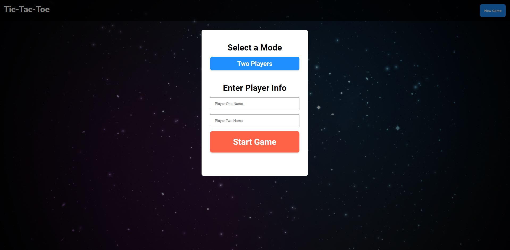
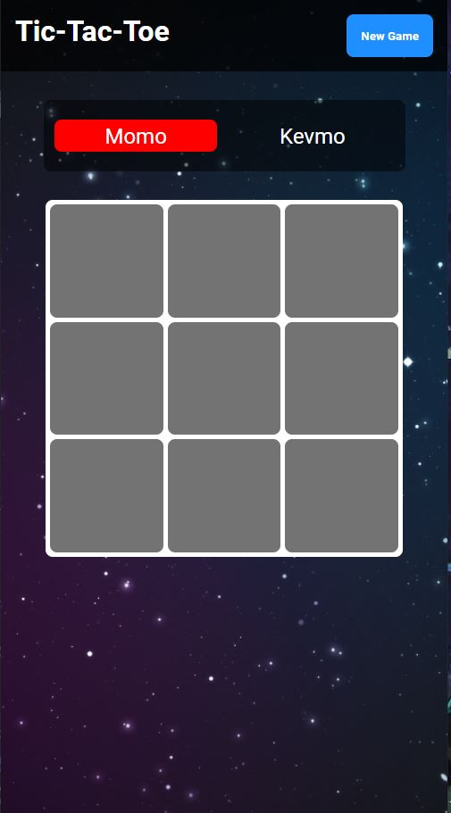

# TheOdinProject - TIC TAC TOE

This is a solution to the [TIC TAC TOE] https://www.theodinproject.com/paths/full-stack-javascript/courses/javascript/lessons/tic-tac-toe

## Table of contents

- [Overview](#overview)
  - [The challenge](#the-challenge)
  - [Screenshot](#screenshot)
  - [Links](#links)
- [My process](#my-process)
  - [Built with](#built-with)
  - [What I learned](#what-i-learned)
  - [Continued development](#continued-development)
  - [Useful resources](#useful-resources)
- [Author](#author)

## Overview

### The challenge

Users should be able to:

Create a Tic Tac Toe Game using Javascript functions

### Screenshot





### Links

- Solution URL: [Add solution URL here](https://your-solution-url.com)
- Live Site URL: [Add live site URL here](https://your-live-site-url.com)

## My process

### Built with

- Semantic HTML5 markup
- CSS custom properties
- Flexbox
- CSS Grid
- Vanilla Javascript


### What I learned

AddEventlistner using {once: true} will only allow you to click the item once. 
Create an array that you can match it to what you are looking for with .every()
function. Learned a little more to create Dom elements. Also getting the used of
how javascript is functioning tomorrow. 


```js
function checkWin(currentPlayer) {
    return winningCombo.some(combo => {
        return combo.every(index => {
            return tiles[index].classList.contains(currentPlayer);
        })
    })
};
};
```


### Continued development

I would like to learn more about Factory Functions and how I can apply that to the project that I created. I would also like to be able to have a cleaner looking code. I can admit everything is coming along as far as how javascript works. I would also like to revisit this project with the ability to create an AI.


### Useful resources

- [https://www.youtube.com/watch?v=Y-GkMjUZsmM&t=1890s](- Web Dev simplified helped me with this project and help me create the backbone of this. I would like to be at the state where I can create a game without following a video. Thank you Web Dev simplified for providing the only video I was able to find that was easy to understand and follow. 


## Author

- Twitter - [@CodeKevo](https://www.twitter.com/CodeKevo)


